# Projekt: League of Legends történetei a mogyoró héjban

# Forrás

[Lásd itt](jegyzet.txt)

### https://universe.leagueoflegends.com/hu_HU/

A projekt a League of Legends játék külön világának a történeteinek a rövidített lényegretörő részeiről fog szólni

# - Honlap
# Header
## Navbar
Főoldal, Runeterra kezdete, Régiók, Karakterek
### Egy részt oldalon belüli hivatkozás, a Főoldalon és A Runeterra kezdete

# Container

Tőbb section és külön sectionbe grid és cardokba rakva a karakterek és régiók

# Runeterra régiói

## Képanyag

- **Demacia**

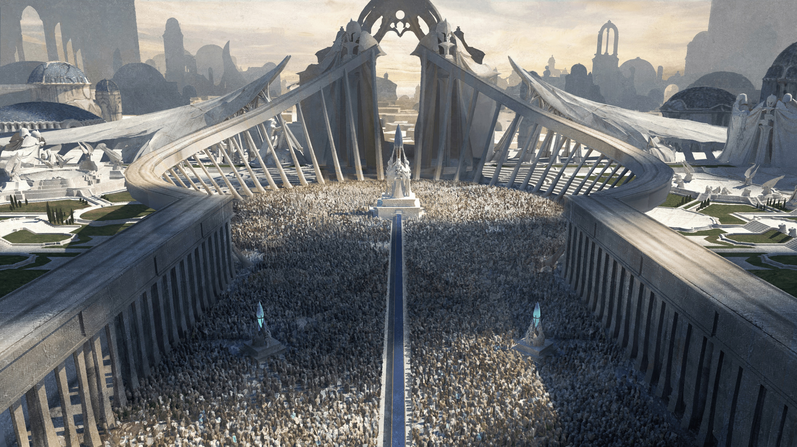

- **Noxus**

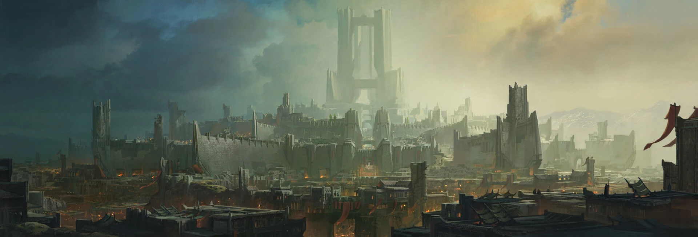

- **Ionia**

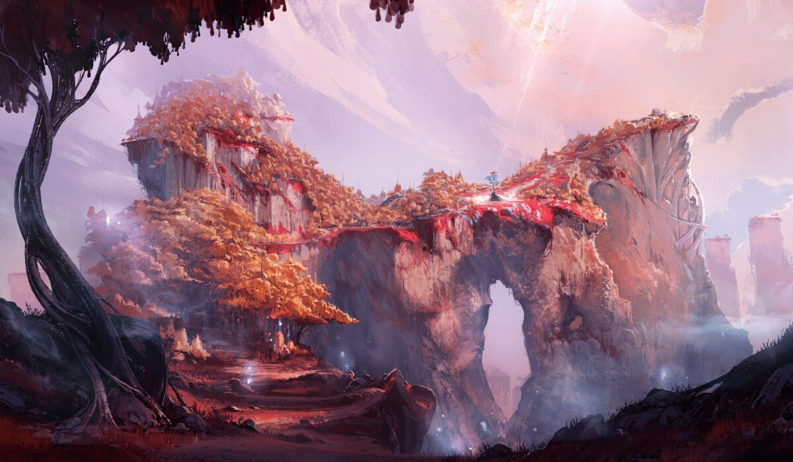

- **Piltover**

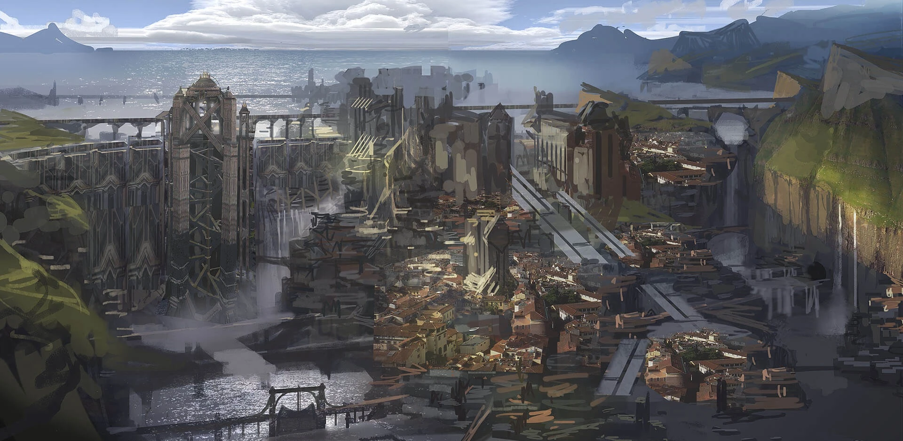
- **Zaun**

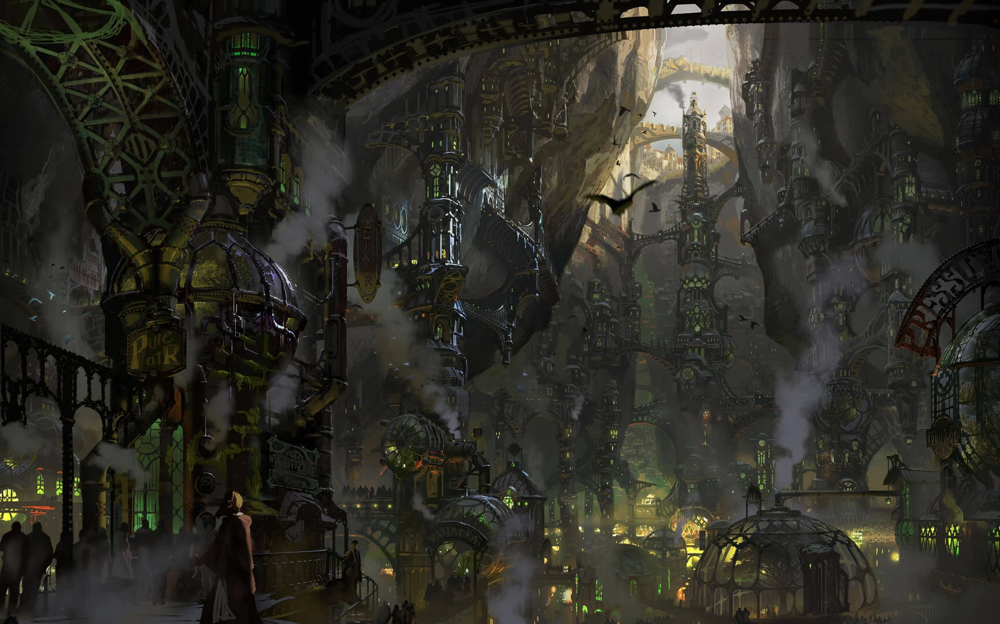
- **Freljord**

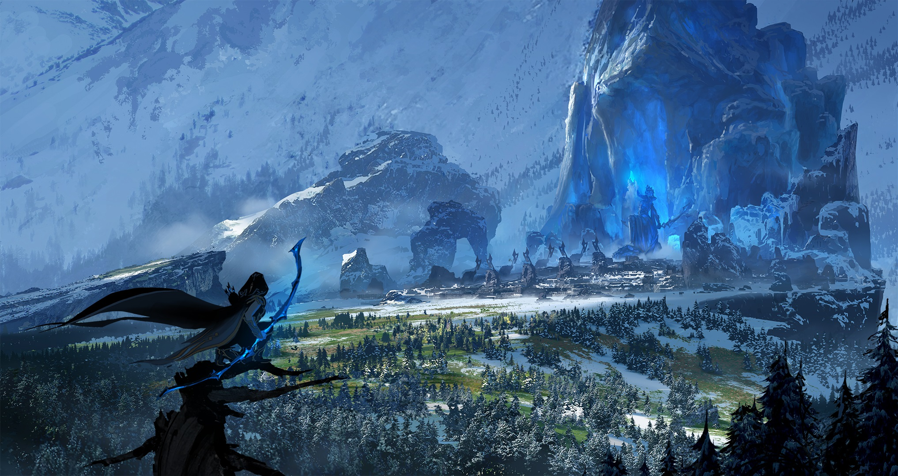
- **Shurima**

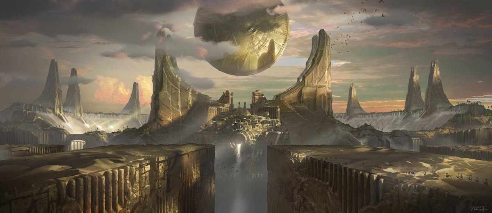
- **Targon**

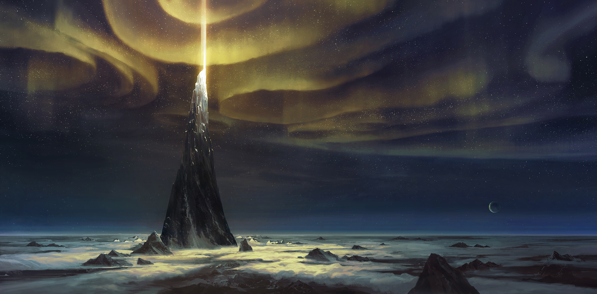
- **Bilgewater**

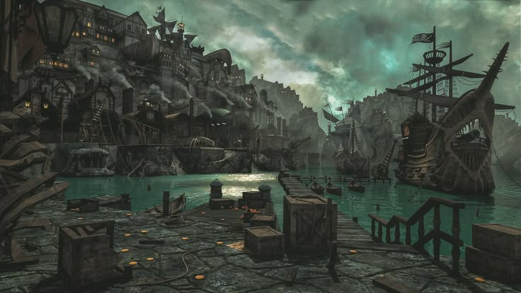
- **Ixtal**

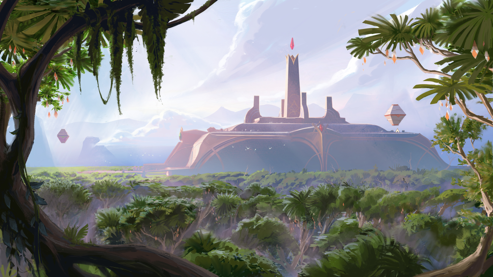
- **Shadow Isles**
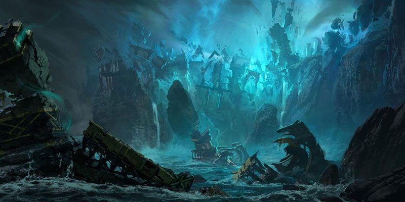

- **Icathia**

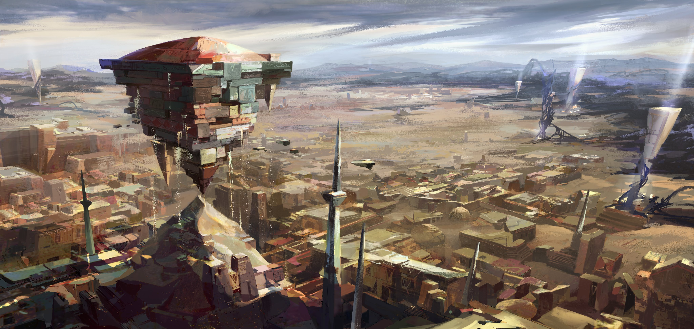

